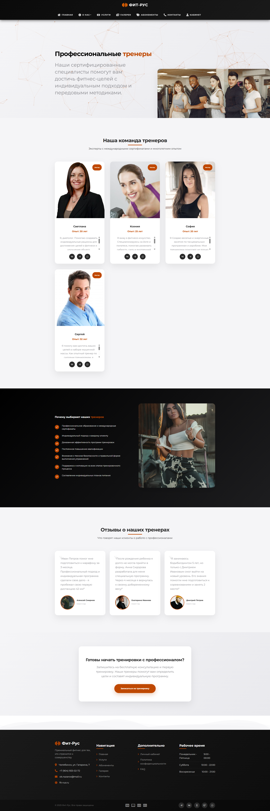
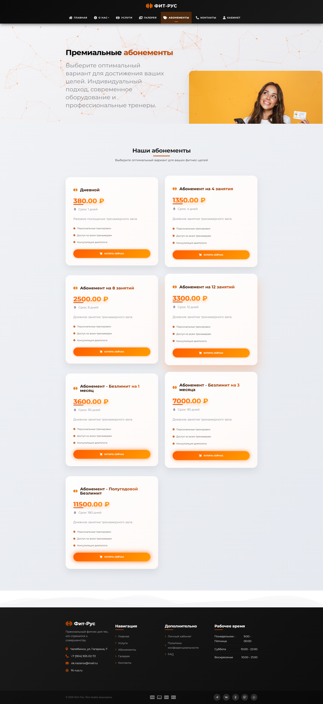

# 💪 ФИТ-РУС — Cовременный сайт фитнес-зала

**ФИТ-РУС** — это полноценный веб-сайт для фитнес-центра, созданный для удобной онлайн-записи, покупки абонементов, взаимодействия с тренерами и получения отзывов.  
Это не просто сайт — это ваш персональный фитнес-помощник 🏋️‍♂️

---

## 🌐 Страницы и функциональность сайта

### 🏠 Главная страница
- Краткая информация о зале
- ✅ **Наши преимущества**
- 💬 **Отзывы клиентов** (отображаются прямо на главной)
- Удобная навигация ко всем разделам

---

### 🏢 О компании
- Кто мы такие
- Почему выбирают именно нас
- Ценности, подход и наша цель

---

### 🏋️ О тренажёрах
- Информация о тренажёрах
- 💡 **Как правильно использовать**
- 🧠 Рекомендации по тренировкам

---

### 👨‍🏫 Тренеры
- Наши профессиональные тренеры
- Опыт, достижения, направления
- Почему именно **наши тренеры — выбор №1**

---

### 🛎️ Услуги
- Все основные **услуги**, входящие в абонементы
- Наши специальные предложения и акции

---

### 🖼️ Галерея
- 📸 Фотографии и отрывки с тренировок
- Атмосфера зала, реальные кадры с занятий

---

### 🎟️ Абонементы
- 💵 Одноразовый
- 📆 Месячный
- 📅 Годовой

> ⚠️ Чтобы приобрести абонемент, необходимо **авторизоваться**

---

### 📞 Контакты
- 📬 Обратная форма (доступна **даже без авторизации**)
- 📍 Контактная информация: адрес, телефон, e-mail

---

### 👤 Личный кабинет
После регистрации и входа пользователь получает доступ к:

- 💳 **Покупке абонементов**
- 📅 Выбору даты и времени тренировок
- 🧑‍🏫 Выбору тренера
- 💵 Выбору способа оплаты
- 🔁 Просмотру своих данных и истории покупок
- 📝 Оставлению отзыва после тренировки

---

## ⚙️ Технологии

- **Frontend**: HTML5, CSS3, JavaScript, Bootstrap 5.3
- **Backend**: PHP 8.2, Laravel 10
- **База данных**: MySQL
- **Структура**: MVC
- **Функции**: Авторизация, валидация, обработка форм, защита данных
- **Адаптивный дизайн**: идеально работает на ПК, планшетах и смартфонах

---

## 📸 Скриншоты 

| Главная | Тренеры | Абонементы |
|--------|---------|------------|
|  |  |  |

---

## 🚀 Онлайн-версия проекта

🔗 **Сайт доступен здесь:**  
🌍 [http://oknazazx.beget.tech/](http://oknazazx.beget.tech/)

❗На GitHub выложена только часть проекта (frontend и маршруты), так как полный проект слишком объёмный для загрузки. Однако вы можете ознакомиться с полной версией по ссылке выше.

---

## 📁 Структура проекта (в GitHub)

- `resources/views/` — шаблоны страниц
- `routes/web.php` — маршруты
- `public/` — публичные стили и frontend
- `.env.example` — пример файла конфигурации
- `README.md` — текущее описание проекта

---

## 📩 Связь с автором

- 📬 Telegram: [@nazarov.elegant](https://t.me/nazarov.elegant)
- 📸 Instagram: [nazarov.elegant](https://instagram.com/nazarov.elegant)

---

## 👨‍💻 Автор проекта

Разработка: **Назаров Ш.Д**  
Роль: Fullstack / Frontend разработчик  
Философия: вера, терпение, развитие  
Проект сделан с любовью к коду и заботой о пользователе ❤️

---

## 📅 Год создания

**2025**

---

## 📘 Лицензия

Открытый исходный код — можно использовать как шаблон, с обязательным упоминанием автора при публикации 🙌
